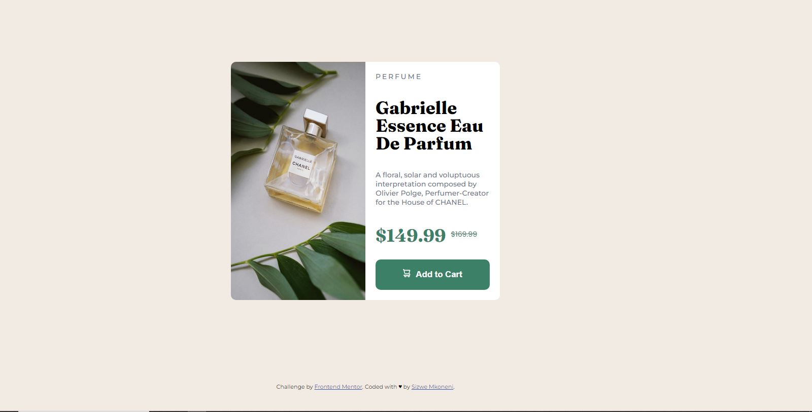
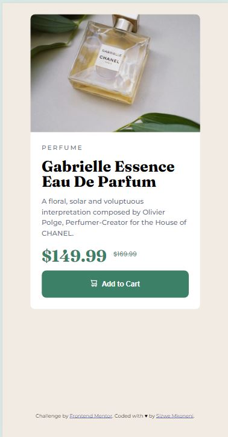

# Frontend Mentor - Product preview card component solution

This is a solution to the [Product preview card component challenge on Frontend Mentor](https://www.frontendmentor.io/challenges/product-preview-card-component-GO7UmttRfa).

## Table of contents

- [Overview](#overview)
  - [The challenge](#the-challenge)
  - [Screenshot](#screenshot)
  - [Links](#links)
- [My process](#my-process)
  - [Built with](#built-with)
  - [What I learned](#what-i-learned)
  - [Continued development](#continued-development)
- [Author](#author)
- [Acknowledgments](#acknowledgments)

## Overview

### The challenge

Users should be able to:
  View the optimal layout for the card depending on their device's screen size.

### Screenshot





### Links

- Solution URL: [Add solution URL here](https://your-solution-url.com)
- Live Site URL: [Add live site URL here](https://your-live-site-url.com)

## My process

### Built with

- Semantic HTML5 markup
- CSS custom properties
- Flexbox
- CSS Grid
- Mobile-first workflow

### What I learned

During the development of this project, I focused on creating a responsive design using a mobile-first approach. 

```html
    <div class="image">
      
    </div>
```
```css
.image{
    width: 50%;
    height: 100%;
    float: left;
}

.image img{
    width: 100%;
    height: 100%;
    border-radius: 10px 0 0 10px;
}

@media (max-width: 557px){
  .image{
      width: 100%;
      height: 40%;
      float: left;
      background-image: url(images/image-product-mobile.jpg);
      background-repeat: no-repeat;
      background-size: cover;
      border-radius: 10px 10px 0 0;
  }

  .image img{
      display: none;
      
  }
}
```

### Continued development

In future projects, I want to further explore: 
  - Advanced CSS layouts like CSS Grid.
  - Better accessibility practices.

## Author

- Frontend Mentor - [@SizweDoctorMkoneni](https://www.frontendmentor.io/profile/SizweDoctorMkoneni)
- GitHub - [@izweDoctorMkoneni](https://github.com/SizweDoctorMkoneni)

## Acknowledgments

Thanks to Frontend Mentor for providing this challenge and the community for inspiration and support.